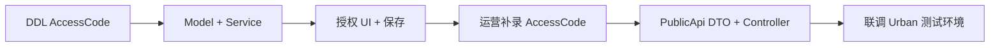

# BasePlatform AccessCode 分列与 ListProjects 拟稿提案

> **文档类型**：拟稿提案（Draft Proposal）  
> **创建日期**：2026-06-24  
> **状态**：拟稿 — 待评审后进入 BasePlatform 仓库实施  
> **主题**：`JC_ProductAuthority` **接入码 / 机器码分列**、授权后台 UI、PublicApi **`ListProjects` 字段纠正**  
> **范围**：`FdSoft.BasePlatform`、`FdSoft.BasePlatform.PublicApi`、`FdSoft.BasePlatform.Model`（上述主题相关改动）  
> **不在范围**：JWT 签发（→ [03](./03-BasePlatform-JWT签发迁移拟稿提案.md)）、UrbanManagement、MaterialClient  
> **JWT 范围**：本提案 **AccessCode / MachineCode 分列** 适用于 **5001、5010** 授权页；**JWT 签发、离线下载、在线 `jwtToken`** 等见 [03](./03-BasePlatform-JWT签发迁移拟稿提案.md)，**仅 ProductCode `5001`**。`5000` 等产品 **零改动**。

**前置文档**：[00-问题分析.md](./00-问题分析.md) · [01-解决方案.md](./01-解决方案.md)

---

## 1. 提案摘要

在 BasePlatform 侧将 **接入码** 与 **设备机器码** 分列存储与暴露：

| 字段 | 表 / 层 | 职责 |
|------|---------|------|
| `AccessCode` | `JC_ProductAuthority`（**新增列**） | 城管接入码，运营在授权页维护（5001/5010） |
| `MachineCode` | `JC_ProductAuthority`（语义收紧） | 仅设备码，客户端 `SetCorpAuthMachineCode` 回写 |
| `AccessCode` | `ProjectCatalogItemDto` / `ListProjects` | 可控、**可空**字符串（`string?`），库表直出 |
| `MachineCode` | `ProjectCatalogItemDto` / `ListProjects` | 可控、**可空**字符串（`string?`），库表直出 |

**本提案不修改** `JC_Project.ShigongCerNo`，不参与城管同步链路。

---

## 2. 目标与非目标

### 2.1 目标

1. `JC_ProductAuthority` **仅新增** `AccessCode` 列（`NVARCHAR NULL`）；**不**对现有 `MachineCode` 做 SQL 批量修复，历史接入码由运营在授权页手工维护。
2. 授权后台（`FdSoft.BasePlatform`）UI 与保存逻辑：接入码 / 机器码分列、**均可由运营编辑**；保存时各字段独立持久化，避免改一项清空另一项。
3. `SetCorpAuthMachineCode` 仅更新 `MachineCode`，不触碰 `AccessCode`；5001 开放与 5000 相同的绑定能力。
4. `FdSoft.BasePlatform.PublicApi`：`ProjectCatalogController.ListProjects` 输出 `AccessCode`、`MachineCode`；筛选改为 `AccessCode` 非空 + 已授权。
5. `ProjectCatalogItemDto` **删除** `BuildLicenseNo`；PublicApi 仅输出 `accessCode`、`machineCode`（**不**输出已废弃的 `fdBuildLicenseNo`）。

### 2.2 非目标（见分册拟稿）

| 主题 | 文档 |
|------|------|
| JWT 签发迁入 BasePlatform | [03-BasePlatform-JWT签发迁移拟稿提案.md](./03-BasePlatform-JWT签发迁移拟稿提案.md) |
| UrbanManagement（AccessCode + JWT 代理/下线） | [04-UrbanManagement迁移拟稿提案.md](./04-UrbanManagement迁移拟稿提案.md) |
| 发版顺序与依赖 | [05-联合发版说明.md](./05-联合发版说明.md) |
| MaterialClient.Urban 客户端改造 | [06](./06-MaterialClient.Urban迁移拟稿提案.md) |

### 2.3 与 JWT 迁移的接口约定

- 本提案落地后，`JC_ProductAuthority.AccessCode` 为 JWT Claims 中 `accessCode` 的数据源（见 03）。
- 本提案 **不包含** `/api/auth/license-file` 实现。

**联合发版**：[05-联合发版说明.md](./05-联合发版说明.md)

## 3. 涉及仓库与项目

| 路径 | 项目 | 改动类型 |
|------|------|----------|
| `D:\CodeUp\FdSoft.BasePlatform\FdSoft.BasePlatform.Model` | Model | 实体、DTO |
| `D:\CodeUp\FdSoft.BasePlatform\FdSoft.BasePlatform` | Web 宿主 | 视图、Controller |
| `D:\CodeUp\FdSoft.BasePlatform\FdSoft.BasePlatform.Service` | Service | 授权保存、机器码绑定 |
| `D:\CodeUp\FdSoft.BasePlatform.PublicApi` | PublicApi | 项目目录同步 API |

---

## 4. 数据库变更（SQL 脚本）

**对象**：`dbo.JC_ProductAuthority`（**不**新建库、不分库）  
**策略**：**只加列**；现有 `MachineCode` **原样保留**；接入码 / 机器码语义对齐由 **运营在授权后台手工录入**。

| 脚本 | 方向 | 说明 |
|------|------|------|
| `forward-01-ddl-add-accesscode.sql` | 正向 | 新增 `AccessCode` 列（幂等） |
| `rollback-01-drop-accesscode.sql` | 回滚 | 应用已回滚后删除列（慎用） |
| `forward-02-index-accesscode.sql` | 正向可选 | `ListProjects` 按接入码筛选时可加 |
| `rollback-02-drop-index.sql` | 回滚可选 | 删除上述索引 |

**不实施**：批量 `UPDATE` 把 `MachineCode` 迁入 `AccessCode`、清空 `MachineCode`、专用备份表及分阶段数据回滚。

---

### 4.1 上线前检查（只读 · 可选）

```sql
-- 文件：check-before-accesscode-ddl.sql
SELECT c.name, t.name AS type_name, c.max_length, c.is_nullable
FROM sys.columns c
JOIN sys.types t ON c.user_type_id = t.user_type_id
WHERE c.object_id = OBJECT_ID(N'dbo.JC_ProductAuthority')
  AND c.name IN (N'AccessCode', N'MachineCode');

-- 运营待维护：AccessCode 为空的 5001/5010 授权（发版后需在后台补录）
SELECT COUNT(*) AS PendingOpsAccessCode
FROM dbo.JC_ProductAuthority
WHERE ProductCode IN (5001, 5010)
  AND DeleteStatus = 0
  AND (AccessCode IS NULL OR LTRIM(RTRIM(AccessCode)) = '');
```

---

### 4.2 正向：新增 `AccessCode` 列

```sql
-- =============================================================================
-- 文件：forward-01-ddl-add-accesscode.sql
-- 回滚：rollback-01-drop-accesscode.sql
-- =============================================================================
SET NOCOUNT ON;

IF NOT EXISTS (
    SELECT 1
    FROM sys.columns
    WHERE object_id = OBJECT_ID(N'dbo.JC_ProductAuthority')
      AND name = N'AccessCode'
)
BEGIN
    ALTER TABLE dbo.JC_ProductAuthority
    ADD AccessCode NVARCHAR(200) NULL;

    PRINT N'已添加列 JC_ProductAuthority.AccessCode';
END
ELSE
    PRINT N'列 AccessCode 已存在，跳过';
```

---

### 4.3 正向：索引（可选）

`ListProjects` 按 `AccessCode` 非空筛选时建议创建：

```sql
-- =============================================================================
-- 文件：forward-02-index-accesscode.sql
-- 回滚：rollback-02-drop-index.sql
-- =============================================================================
IF NOT EXISTS (
    SELECT 1 FROM sys.indexes
    WHERE object_id = OBJECT_ID(N'dbo.JC_ProductAuthority')
      AND name = N'IX_JC_ProductAuthority_AccessCode'
)
BEGIN
    CREATE NONCLUSTERED INDEX IX_JC_ProductAuthority_AccessCode
    ON dbo.JC_ProductAuthority (ProductCode, AccessCode)
    WHERE DeleteStatus = 0 AND AccessCode IS NOT NULL;
END
```

---

### 4.4 回滚：删除 `AccessCode` 列

**前置**：应用已回滚至不读写 `AccessCode`；列内数据可丢弃（运营录入值需接受丢失或事先导出）。

```sql
-- =============================================================================
-- 文件：rollback-01-drop-accesscode.sql
-- =============================================================================
SET NOCOUNT ON;

IF EXISTS (
    SELECT 1 FROM sys.indexes
    WHERE object_id = OBJECT_ID(N'dbo.JC_ProductAuthority')
      AND name = N'IX_JC_ProductAuthority_AccessCode'
)
    DROP INDEX IX_JC_ProductAuthority_AccessCode ON dbo.JC_ProductAuthority;

IF EXISTS (
    SELECT 1 FROM sys.columns
    WHERE object_id = OBJECT_ID(N'dbo.JC_ProductAuthority')
      AND name = N'AccessCode'
)
    ALTER TABLE dbo.JC_ProductAuthority DROP COLUMN AccessCode;
```

---

### 4.5 回滚：删除索引（可选）

```sql
-- 文件：rollback-02-drop-index.sql
IF EXISTS (
    SELECT 1 FROM sys.indexes
    WHERE object_id = OBJECT_ID(N'dbo.JC_ProductAuthority')
      AND name = N'IX_JC_ProductAuthority_AccessCode'
)
    DROP INDEX IX_JC_ProductAuthority_AccessCode ON dbo.JC_ProductAuthority;
```

---

### 4.6 运营手工对齐（非 SQL）

发版后由运营在 `ProjectAuthAdd` / `CompanyAuthAdd`：

1. 为 5001/5010 项目填写 **接入码** → `AccessCode`；
2. 按需修正 **机器码** → `MachineCode`（**不**假设历史 `MachineCode` 一定是接入码）；
3. 填妥 `AccessCode` 后，项目才会出现在 `ListProjects`（筛选条件：接入码非空 + 已授权）。

---

## 5. Model 层变更清单

| 文件 | 变更 |
|------|------|
| `Models/BasePlatform/JCProductAuthority.cs` | 新增 `AccessCode`（`NVARCHAR NULL`，`string?` 可控可空字符串） |
| `Dto/BasePlatformPublicApi/ProjectCatalogItemDto.cs` | 新增 `AccessCode`、`MachineCode`（`string?`）；**删除** `BuildLicenseNo` 属性 |
| `DtoExt/BasePlatform/AddAuthExtDto.cs` | 新增 `AccessCode` |
| `DtoExt/BasePlatform/CorpAuthDto.cs` / `ProjectAuthDto.cs` | 新增 `AccessCode`（若共用） |
| `Dto/BasePlatform/JCProductAuthorityDto.cs` | 映射 `AccessCode` |

---

## 6. FdSoft.BasePlatform（Web + Service）

### 6.1 授权视图

**文件**：`Views/Auth/ProjectAuthAdd.cshtml`、`Views/Auth/CompanyAuthAdd.cshtml`

| ProductCode | 接入码 | 机器码 |
|-------------|--------|--------|
| 5000 MaterialClient | 不展示 | 只读 `MachineCode`（客户端 `SetCorpAuthMachineCode` 回写，现状） |
| 5001 / 5010 | 可编辑 `AccessCode` | 可编辑 `MachineCode` |

- 标签「接入码」绑定 `name="AccessCode"`，「机器码」绑定 `name="MachineCode"`，两字段分列、互不混写。
- 移除将非 5000 产品的接入码录入到 `MachineCode` 的隐含约定。

### 6.2 Controller

**文件**：`Controllers/AuthController.cs`

| 方法 | 变更要点 |
|------|----------|
| `ProjectAuthAdd` GET | `projectAuthDto.AccessCode`、`MachineCode` 从 `dbProductAuth` 加载 |
| `CompanyAuthAdd` GET | 同上 |
| `ProjectAuthAdd` POST | 持久化 `AccessCode`、`MachineCode` |
| `CompanyAuthAdd` POST | 持久化 `AccessCode`、`MachineCode`（表单提交值分别写入对应列） |
| `SendAuthLicense` | **仅 5001**：Redis 载荷可增加 `AccessCode`；**非 5001** 载荷与现网完全一致 |

**文件**：`API/ProjectAuthController.cs` — `SetCorpAuthMachineCode` 路径不变，Service 层保证不写 `AccessCode`。

### 6.3 Service

**文件**：`Service/BasePlatform/AuthService.cs` — `ProjectAuthAdd`

```csharp
// 更新时：AccessCode、MachineCode 随表单一并持久化（string?，未填可为 null）
.SetColumns(o => new JCProductAuthority
{
    AuthStatus = (byte)addAuthExtDto.AuthStatus,
    AccessCode = addAuthExtDto.AccessCode,
    MachineCode = addAuthExtDto.MachineCode,
    ...
})
```

**文件**：`Service/BasePlatform/JCProductAuthorityService.cs`

```csharp
public bool SetCorpAuthMachineCode(MaterialMachineCode req)
{
    var authmodel = GetFirst(x => x.ProId == req.ProId && x.AuthToken == req.AuthToken);
    if (authmodel == null) return false;
    authmodel.MachineCode = req.MachineCode;
    // 禁止：authmodel.AccessCode = ...
    return Update(authmodel, false) > 0;
}
```

**文件**：`Service/BasePlatform/JCProjectService.cs` — 授权列表 DTO 映射增加 `AccessCode`；5001 `IsShowInvalidBtn` 等逻辑改为依据 `MachineCode`（非 `AccessCode`）。

### 6.4 配置与枚举

- `ProductExtEnum`：5001、5010 同时展示 `AccessCode`、`MachineCode` 录入框（均可编辑）。
- 无需新增 `appsettings` 开关（本提案范围）。

---

## 7. FdSoft.BasePlatform.PublicApi

### 7.1 `ProjectCatalogController.ListProjects`

**文件**：`Controllers/ProjectCatalogController.cs`

**删除**：

```csharp
BuildLicenseNo = authority.MachineCode ?? string.Empty,
```

**改为**：

```csharp
AccessCode  = authority.AccessCode,
MachineCode = authority.MachineCode,
```

**authority 查询**增加 `a.AccessCode`；`authorityMap` / `ProjectCatalogAuthorityInfo` record 同步扩展。

**筛选**：

```csharp
.Where(a => a.ProductCode == TargetProductCode
            && a.DeleteStatus == 0
            && a.AuthStatus == 1
            && !string.IsNullOrEmpty(a.AccessCode))
```

### 7.2 API 契约（拟稿）

**请求**：`GET .../ProjectCatalog/ListProjects?pageIndex=1&pageSize=500`（不变）

**响应 `items[]` 字段变更**：

| 字段 | 类型 | 变更 |
|------|------|------|
| `accessCode` | 可控可空字符串 | **新增**，`authority.AccessCode` 直出 |
| `machineCode` | 可控可空字符串 | **新增**，`authority.MachineCode` 直出 |
| ~~`buildLicenseNo`~~ | — | **删除** |
| ~~`fdBuildLicenseNo`~~ | — | **删除**（凡东 MD5，已废弃） |

> `accessCode`、`machineCode` 均为运营或客户端可维护的**可空字符串**（C# `string?`）。

**破坏性变更（已接受）**：UrbanManagement **未上线**，唯一下游可与 PublicApi **同期改造**；`ListProjects` 响应**不再**包含 `buildLicenseNo`，无需 `EmitObsoleteBuildLicenseNo` 或 DTO 别名。

## 8. 实施顺序（AccessCode 分列）



| 步骤 | 工作项 | 预估 |
|------|--------|------|
| 1 | DDL（`forward-01`）+ 实体 + DTO | 0.5d |
| 2 | AuthService / AuthController 保存规则 | 1d |
| 3 | 授权视图拆分 | 0.5d |
| 4 | SetCorpAuthMachineCode 隔离 + 5001 白名单 | 0.5d |
| 5 | 运营手工补录接入码（无 SQL 洗数） | 并行 |
| 6 | PublicApi ListProjects + DTO | 0.5d |
| 7 | 回归：5000 物料客户端授权不受影响 | 0.5d |
| 8 | 回归：5010 不走 JWT 路径（仍 `DownloadAuth` 等现网） | 0.5d |
| **合计** | | **~3.5d**（不含运营补录周期） |

---

## 9. 测试清单（BasePlatform 范围）

| # | 场景 | 预期 |
|---|------|------|
| 1 | 5001 运营保存接入码 | `AccessCode` 更新；未改动的 `MachineCode` 保持 |
| 1b | 5001 运营手工改机器码 | `MachineCode` 更新；`AccessCode` 保持 |
| 2 | 5001 客户端 `SetCorpAuthMachineCode` | `MachineCode` 更新，`AccessCode` 不变 |
| 3 | 5001 运营只改到期日 | 不清空 `MachineCode` |
| 4 | 5000 机器码绑定 | 行为与改造前一致 |
| 5 | `ListProjects` 返回 | 含 `accessCode`、`machineCode`；未填/未绑定时为 `null` |
| 6 | 无 `AccessCode` 的 5001 授权 | 不出现在目录列表（运营补录后可见） |
| 7 | 响应 JSON | **不含** `buildLicenseNo`、`fdBuildLicenseNo` |

---

## 10. 回滚方案

| 层级 | 动作 | 脚本 |
|------|------|------|
| 应用 | PublicApi / Web 回滚部署包 | — |
| DDL | 删除 `AccessCode` 列 | §4.4 `rollback-01-drop-accesscode.sql` |
| 索引 | 删除可选索引 | §4.5 `rollback-02-drop-index.sql` |
| UI | 回滚视图与 Controller | — |

**说明**：无批量数据迁移，**不需要**数据回滚脚本；删列将丢失运营已录入的 `AccessCode`。

---

## 11. 风险与依赖

| 风险 | 缓解 |
|------|------|
| PublicApi 字段变更 | Urban 未上线，与 04 Pull 同期发版即可；无兼容别名 |
| 运营未补录 `AccessCode` | `ListProjects` 暂缺项目；运营在后台补录 |
| 历史 `MachineCode` 含义混杂 | **不** SQL 自动迁移；运营按项目手工区分接入码与设备码 |

**外部依赖**：Urban 侧见 [04-UrbanManagement迁移拟稿提案.md](./04-UrbanManagement迁移拟稿提案.md)；发版顺序见 [05](./05-联合发版说明.md)。

---

## 12. 拟稿评审检查项

- [ ] DBA 确认 `AccessCode` 长度与索引
- [ ] 产品确认 5001/5010 授权页交互（接入码 + 机器码均可编辑）
- [ ] Urban Pull（04）与 PublicApi 字段契约对齐（`accessCode` / `machineCode`，无 `buildLicenseNo`）
- [ ] 预发执行 `forward-01-ddl-add-accesscode.sql`
- [ ] 运营补录计划：5001/5010 项目 `AccessCode` 录入节奏
- [ ] 5000 回归用例通过

---

## 13. 文档索引

| 编号 | 文档 | 说明 |
|------|------|------|
| 00 | [00-问题分析.md](./00-问题分析.md) | 问题发现 |
| 01 | [01-解决方案.md](./01-解决方案.md) | 全链路总方案 |
| 02 | [02-BasePlatform-AccessCode分列与ListProjects拟稿提案.md](./02-BasePlatform-AccessCode分列与ListProjects拟稿提案.md) | 本文档 |
| 03 | [03-BasePlatform-JWT签发迁移拟稿提案.md](./03-BasePlatform-JWT签发迁移拟稿提案.md) | JWT 签发迁入 BasePlatform |
| 04 | [04-UrbanManagement迁移拟稿提案.md](./04-UrbanManagement迁移拟稿提案.md) | Urban 配合迁移 |
| 05 | [05-联合发版说明.md](./05-联合发版说明.md) | 发版顺序与依赖 |

---

**文档版本**：0.3（拟稿）  
**最后更新**：2026-06-24
