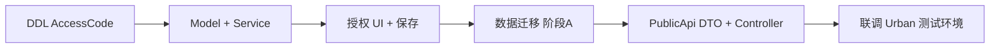

# BasePlatform / PublicApi 实施拟稿提案

> **文档类型**：拟稿提案（Draft Proposal）  
> **创建日期**：2026-06-24  
> **状态**：拟稿 — 待评审后进入 BasePlatform 仓库实施  
> **范围**：**仅** `FdSoft.BasePlatform`、`FdSoft.BasePlatform.PublicApi`（及共享 `FdSoft.BasePlatform.Model`）  
> **不在范围**：UrbanManagement、MaterialClient、MaterialClient.Urban（见 [01-解决方案.md](./01-解决方案.md) 其他 Phase）

**前置文档**：[00-问题分析.md](./00-问题分析.md) · [01-解决方案.md](./01-解决方案.md)

---

## 1. 提案摘要

在 BasePlatform 侧将 **接入码** 与 **设备机器码** 分列存储与暴露：

| 字段 | 表 / 层 | 职责 |
|------|---------|------|
| `AccessCode` | `JC_ProductAuthority`（**新增列**） | 城管接入码，运营在授权页维护（5001/5010） |
| `MachineCode` | `JC_ProductAuthority`（语义收紧） | 仅设备码，客户端 `SetCorpAuthMachineCode` 回写 |
| `AccessCode` | `ProjectCatalogItemDto` / `ListProjects` | 替代错误命名的 `BuildLicenseNo` |
| `FdBuildLicenseNo` | PublicApi 计算字段 | 保持 `MD5(ProId + "findongCode")` |

**本提案不修改** `JC_Project.ShigongCerNo`，不参与城管同步链路。

---

## 2. 目标与非目标

### 2.1 目标

1. `JC_ProductAuthority` 增加 `AccessCode`，并完成 5001/5010 历史数据迁移脚本（可灰度）。
2. 授权后台（`FdSoft.BasePlatform`）UI 与保存逻辑：接入码 / 机器码分列；运营保存不覆盖已绑定 `MachineCode`。
3. `SetCorpAuthMachineCode` 仅更新 `MachineCode`，不触碰 `AccessCode`；5001 开放与 5000 相同的绑定能力。
4. `FdSoft.BasePlatform.PublicApi`：`ProjectCatalogController.ListProjects` 输出 `AccessCode`、`MachineCode`；筛选改为 `AccessCode` 非空 + 已授权。
5. 可选：DTO 保留 `[Obsolete] BuildLicenseNo` 别名，供尚未升级的下游只读兼容一个版本。

### 2.2 非目标（其他仓库 / 后续提案）

- UrbanManagement `GovProject` 列重命名、`GovProjectPullBackgroundWorker` 映射。
- MaterialClient.Urban `LicenseInfo`、JWT Claims、`accessCode` 改造。
- 政府 HTTP 出站 `buildLicenseNo` 字段映射（由 Urban 提案承接）。

---

## 3. 涉及仓库与项目

| 路径 | 项目 | 改动类型 |
|------|------|----------|
| `D:\CodeUp\FdSoft.BasePlatform\FdSoft.BasePlatform.Model` | Model | 实体、DTO |
| `D:\CodeUp\FdSoft.BasePlatform\FdSoft.BasePlatform` | Web 宿主 | 视图、Controller |
| `D:\CodeUp\FdSoft.BasePlatform\FdSoft.BasePlatform.Service` | Service | 授权保存、机器码绑定 |
| `D:\CodeUp\FdSoft.BasePlatform.PublicApi` | PublicApi | 项目目录同步 API |

---

## 4. 数据库变更

### 4.1 DDL

```sql
-- 生产执行前全库备份
IF NOT EXISTS (
    SELECT 1 FROM sys.columns
    WHERE object_id = OBJECT_ID(N'dbo.JC_ProductAuthority')
      AND name = N'AccessCode'
)
BEGIN
    ALTER TABLE dbo.JC_ProductAuthority
    ADD AccessCode NVARCHAR(200) NULL;
END
```

### 4.2 历史数据迁移（拟稿，上线前抽样）

```sql
-- 阶段 A：双写（可重复执行）
UPDATE a
SET a.AccessCode = NULLIF(LTRIM(RTRIM(a.MachineCode)), '')
FROM dbo.JC_ProductAuthority a
WHERE a.ProductCode IN (5001, 5010)
  AND a.DeleteStatus = 0
  AND (a.AccessCode IS NULL OR a.AccessCode = '')
  AND NULLIF(LTRIM(RTRIM(a.MachineCode)), '') IS NOT NULL;

-- 阶段 B：确认无真设备码误迁后，清空 MachineCode（单独变更单，可延后）
-- UPDATE ... SET MachineCode = NULL WHERE ProductCode IN (5001,5010) AND ...
```

### 4.3 索引（可选）

```sql
CREATE NONCLUSTERED INDEX IX_JC_ProductAuthority_AccessCode
ON dbo.JC_ProductAuthority (ProductCode, AccessCode)
WHERE DeleteStatus = 0 AND AccessCode IS NOT NULL;
```

---

## 5. Model 层变更清单

| 文件 | 变更 |
|------|------|
| `Models/BasePlatform/JCProductAuthority.cs` | 新增 `AccessCode` 属性 |
| `Dto/BasePlatformPublicApi/ProjectCatalogItemDto.cs` | 新增 `AccessCode`、`MachineCode`；移除或 `[Obsolete]` `BuildLicenseNo` |
| `DtoExt/BasePlatform/AddAuthExtDto.cs` | 新增 `AccessCode` |
| `DtoExt/BasePlatform/CorpAuthDto.cs` / `ProjectAuthDto.cs` | 新增 `AccessCode`（若共用） |
| `Dto/BasePlatform/JCProductAuthorityDto.cs` | 映射 `AccessCode` |

---

## 6. FdSoft.BasePlatform（Web + Service）

### 6.1 授权视图

**文件**：`Views/Auth/ProjectAuthAdd.cshtml`、`Views/Auth/CompanyAuthAdd.cshtml`

| ProductCode | 接入码 | 机器码 |
|-------------|--------|--------|
| 5000 MaterialClient | 不展示 | 只读 `MachineCode`（现状） |
| 5001 / 5010 | 可编辑 `AccessCode` | 只读 `MachineCode` |

- 标签「接入码」绑定 `name="AccessCode"`，不再写入 `MachineCode`。
- 移除将非 5000 产品的接入码录入到 `MachineCode` 的隐含约定。

### 6.2 Controller

**文件**：`Controllers/AuthController.cs`

| 方法 | 变更要点 |
|------|----------|
| `ProjectAuthAdd` GET | `projectAuthDto.AccessCode` 从 `dbProductAuth.AccessCode` 加载 |
| `CompanyAuthAdd` GET | 同上 |
| `CompanyAuthAdd` POST | 持久化 `AccessCode`；`MachineCode` 仅在请求体显式携带时更新 |
| `SendAuthLicense` | Redis 载荷增加 `AccessCode`（若下游需要）；`MachineCode` 保持 |

**文件**：`API/ProjectAuthController.cs` — `SetCorpAuthMachineCode` 路径不变，Service 层保证不写 `AccessCode`。

### 6.3 Service

**文件**：`Service/BasePlatform/AuthService.cs` — `ProjectAuthAdd`

```csharp
// 更新时示例：运营未传 MachineCode 则不 SET 该列
.SetColumns(o => new JCProductAuthority
{
    AuthStatus = (byte)addAuthExtDto.AuthStatus,
    AccessCode = addAuthExtDto.AccessCode,
    // MachineCode 仅当 addAuthExtDto.MachineCode 非空时 SetColumnsIF
    ...
})
```

**文件**：`Service/BasePlatform/JCProductAuthorityService.cs`

```csharp
public bool SetCorpAuthMachineCode(MaterialMachineCode req)
{
    var authmodel = GetFirst(x => x.ProId == req.ProId && x.AuthToken == req.AuthToken);
    if (authmodel == null) return false;
    authmodel.MachineCode = req.MachineCode;
    // 禁止：authmodel.AccessCode = ...
    return Update(authmodel, false) > 0;
}
```

**文件**：`Service/BasePlatform/JCProjectService.cs` — 授权列表 DTO 映射增加 `AccessCode`；5001 `IsShowInvalidBtn` 等逻辑改为依据 `MachineCode`（非 `AccessCode`）。

### 6.4 配置与枚举

- `ProductExtEnum`：5001、5010 展示 `AccessCode` 录入；`IsShowMachineCode` 逻辑可拆为「展示接入码」+「展示机器码只读」。
- 无需新增 `appsettings` 开关（本提案范围）。

---

## 7. FdSoft.BasePlatform.PublicApi

### 7.1 `ProjectCatalogController.ListProjects`

**文件**：`Controllers/ProjectCatalogController.cs`

**删除**：

```csharp
BuildLicenseNo = authority.MachineCode ?? string.Empty,
```

**改为**：

```csharp
AccessCode       = authority.AccessCode ?? string.Empty,
FdBuildLicenseNo = CommonHelper.IoTPwdMD5(parsedProId, "findongCode"),
MachineCode      = authority.MachineCode ?? string.Empty,
```

**authority 查询**增加 `a.AccessCode`；`authorityMap` / `ProjectCatalogAuthorityInfo` record 同步扩展。

**筛选**：

```csharp
.Where(a => a.ProductCode == TargetProductCode
            && a.DeleteStatus == 0
            && a.AuthStatus == 1
            && !string.IsNullOrEmpty(a.AccessCode))
```

### 7.2 API 契约（拟稿）

**请求**：`GET .../ProjectCatalog/ListProjects?pageIndex=1&pageSize=500`（不变）

**响应 `items[]` 字段变更**：

| 字段 | 变更 |
|------|------|
| `accessCode` | **新增**，主业务字段 |
| `machineCode` | **新增**（显式输出，可为空） |
| `fdBuildLicenseNo` | 不变 |
| `buildLicenseNo` | **废弃**；兼容期可保留为 `accessCode` 的别名 |

**破坏性说明**：若下游仍读 `buildLicenseNo` 且未升级，须启用 DTO 别名或协调 UrbanManagement 同期发版（Urban 不在本提案内，但 PublicApi 发版前需通知）。

### 7.3 兼容开关（可选，拟稿）

```json
// PublicApi appsettings.json
"ProjectCatalog": {
  "EmitObsoleteBuildLicenseNo": true
}
```

为 `true` 时序列化同时输出 `buildLicenseNo`（= `accessCode`），默认 `true` 一个版本后改 `false`。

---

## 8. 实施顺序（仅 BasePlatform 侧）



| 步骤 | 工作项 | 预估 |
|------|--------|------|
| 1 | DDL + 实体 + DTO | 0.5d |
| 2 | AuthService / AuthController 保存规则 | 1d |
| 3 | 授权视图拆分 | 0.5d |
| 4 | SetCorpAuthMachineCode 隔离 + 5001 白名单 | 0.5d |
| 5 | 迁移脚本阶段 A（双写 AccessCode） | 0.5d |
| 6 | PublicApi ListProjects + DTO | 0.5d |
| 7 | 回归：5000 物料客户端授权不受影响 | 0.5d |
| **合计** | | **~4d** |

---

## 9. 测试清单（BasePlatform 范围）

| # | 场景 | 预期 |
|---|------|------|
| 1 | 5001 运营保存接入码 | `AccessCode` 有值，`MachineCode` 不变 |
| 2 | 5001 客户端 `SetCorpAuthMachineCode` | `MachineCode` 更新，`AccessCode` 不变 |
| 3 | 5001 运营只改到期日 | 不清空 `MachineCode` |
| 4 | 5000 机器码绑定 | 行为与改造前一致 |
| 5 | `ListProjects` 返回 | 含 `accessCode`；不含错误语义的单独 `machineCode` 冒充接入码 |
| 6 | 无 `AccessCode` 的 5001 授权 | 不出现在目录列表 |
| 7 | `EmitObsoleteBuildLicenseNo=true` | JSON 同时含 `buildLicenseNo` == `accessCode` |

---

## 10. 回滚方案

1. **PublicApi**：配置开关恢复旧映射（仅紧急）；或回滚部署包。
2. **数据**：迁移前备份 `JC_ProductAuthority`；阶段 B 清空 `MachineCode` 须单独回滚脚本。
3. **UI**：回滚视图与 Controller 即可；`AccessCode` 列可保留为空列不影响旧逻辑（旧逻辑仍读 `MachineCode` 时需评估是否已执行阶段 B）。

---

## 11. 风险与依赖

| 风险 | 缓解 |
|------|------|
| PublicApi 字段变更导致 Urban 拉取失败 | 兼容别名 + 提前通知；Urban 变更单并行但不阻塞 DDL |
| 迁移误清真 `MachineCode` | 先阶段 A 双写；阶段 B 单独评审 + 抽样 |
| 运营习惯仍填旧 `MachineCode` 框 | 上线说明 + 短期 UI 提示文案 |

**外部依赖**：UrbanManagement 消费方须在某版本改为读 `accessCode`（**本提案不包含其代码修改**）。

---

## 12. 拟稿评审检查项

- [ ] DBA 确认 `AccessCode` 长度与索引
- [ ] 产品确认 5001/5010 授权页交互（接入码 + 机器码只读）
- [ ] PublicApi 下游（Urban）确认兼容窗口
- [ ] 迁移脚本在预发执行并核对抽样 `ProId`
- [ ] 5000 回归用例通过

---

## 13. 文档索引

| 编号 | 文档 |
|------|------|
| 00 | [00-问题分析.md](./00-问题分析.md) |
| 01 | [01-解决方案.md](./01-解决方案.md) |
| 02 | [02-BasePlatform实施拟稿提案.md](./02-BasePlatform实施拟稿提案.md)（本文档） |

---

**文档版本**：0.1（拟稿）  
**最后更新**：2026-06-24
