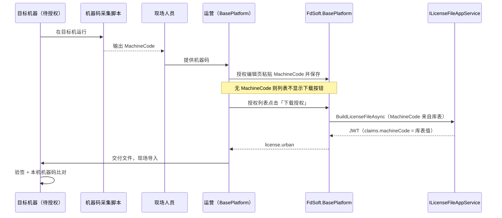

# BasePlatform JWT 签发迁移拟稿提案

> **文档类型**：拟稿提案（Draft Proposal）  
> **创建日期**：2026-06-24  
> **状态**：拟稿 — 待评审后进入 BasePlatform 仓库实施  
> **范围**：`FdSoft.BasePlatform.PublicApi` 签发 API（**仅 ProductCode `5001`**）、`FdSoft.BasePlatform` 管理后台 **5001** 离线下载 UI、**5001** 在线激活 JWT 签发（共用 `ILicenseFileAppService`）  
> **不在范围**：AccessCode 库表与 `ListProjects`（→ [02](./02-BasePlatform-AccessCode分列与ListProjects拟稿提案.md)）、Urban 代理（→ [04](./04-UrbanManagement迁移拟稿提案.md)）、MaterialClient 客户端实现、**非 5001 产品**（`5000`/`5010` 等保持现网）

**前置**：[01-解决方案.md](./01-解决方案.md) · [02](./02-BasePlatform-AccessCode分列与ListProjects拟稿提案.md)（`AccessCode` 列为 Claims 数据源）· [05-联合发版说明.md](./05-联合发版说明.md)

**关联 EPIC**：[00-EPIC-项目改动总览.md](../2026-06-23-baseplatform-auth-solution/00-EPIC-项目改动总览.md) §1.3

---

## 1. 提案摘要

将 UrbanManagement 中的 **`UrbanLicenseGenerator`** 签发能力迁入 BasePlatform，使 **BasePlatform** 成为 **ProductCode 5001** 城管 JWT 的**唯一签发中心**（离线与在线）。

| 项 | 决议 |
|----|------|
| **产品范围** | **仅 `5001`**；`5000`/`5010`/其它 **不**签发 JWT、**不**改 `SendAuthLicense` 现网载荷 |
| **JWT 权威** | 离线与在线均以同一 JWT 为准；客户端 `LatestJwtToken` |
| 新 API | `GET /api/auth/license-file`；`POST /api/auth/activate-urban`（在线，名称可评审） |
| 签名算法 | RS256（与现网 Urban 一致） |
| Issuer / Audience | `UrbanManagement` / `MaterialClient.Urban`（**保持不变**，避免客户端验签变更） |
| Claims | `proId`, `proName`, **`accessCode`**, `machineCode`, `exp`, `jti` |
| 数据源 | `JC_ProductAuthority` + `JC_Project`（`AccessCode` 来自 02） |
| 离线下载 | **必须先有机器码**：目标机运行采集脚本 → 运营在授权页填入 `MachineCode` 并保存 → 列表「下载授权」→ `license.urban`（JWT 含该 `machineCode`） |
| 共用服务 | `ILicenseFileAppService`（Web 与 PublicApi 均调用，避免双份签发逻辑） |

**本提案不包含** Urban 侧代理、Hub 推送、旧签发下线（见 04）；**不包含**客户端 `.urban` 导入实现（见 EPIC）。

---

## 2. 目标与非目标

### 2.1 目标

1. 新增 `BasePlatformJwtTokenGenerator`（自 `UrbanLicenseGenerator` 移植），配置 `Jwt:PrivateKey`。
2. 实现 `AuthController`（或等价）`GET /api/auth/license-file`：按 `machineCode` + `proId` 查授权，组装 Claims 并返回 JWT 文件流或 JSON 包装。
3. Claims 中 **`accessCode`** 取自 `JC_ProductAuthority.AccessCode`（非 `MachineCode`，非 `buildLicenseNo`）。
4. **不**签发 `fdBuildLicenseNo` claim（字段已废弃，见 [01](./01-解决方案.md) §Q2）。
5. 提供集成测试：Issuer、算法、Claim 键名（**不含** `fdBuildLicenseNo` / `buildLicenseNo`）。
6. 在 `FdSoft.BasePlatform` 为 **ProductCode 5001** 提供离线 `.urban` 下载与在线激活 **`jwtToken`**；**无 `MachineCode` 禁止离线下载**。
7. **`SendAuthLicense`**：仅 **5001** 可在 Redis 载荷中增加 `AccessCode`；其它产品载荷 **不变**。

### 2.2 非目标

| 主题 | 文档 |
|------|------|
| `JC_ProductAuthority.AccessCode` DDL / 迁移 | [02](./02-BasePlatform-AccessCode分列与ListProjects拟稿提案.md) |
| Urban `POST /api/urban/auth/activate` 代理实现 | [04](./04-UrbanManagement迁移拟稿提案.md) |
| MaterialClient 写入 `LatestJwtToken` | [EPIC](../2026-06-23-baseplatform-auth-solution/00-EPIC-项目改动总览.md) |
| ~~`POST /api/auth/verify`~~ / ~~`POST /api/urban/auth/verify`~~ | **不实施** |
| `fdBuildLicenseNo` / 凡东 MD5 claim | 已废弃（见 01 §Q2） |
| **非 5001** 的 `SendAuthLicense` / `DownloadAuth` | **不改动**（02 回归） |

### 2.3 与 02 的接口约定

- **硬依赖**：P2 上线前须完成 02 的 P0（`AccessCode` 列有值）；否则 Claims 中 `accessCode` 为空。
- **软并行**：03 代码可与 02 同仓开发；JWT 联调须运营已在后台维护 `AccessCode`（或测试数据手工写入）。

---

## 3. 涉及仓库与项目

| 路径 | 项目 | 改动类型 |
|------|------|----------|
| `FdSoft.BasePlatform.PublicApi` | PublicApi | 新 Controller / 端点 |
| `FdSoft.BasePlatform` | Web 宿主 | 下载 Action、视图按钮、前端 JS |
| `FdSoft.BasePlatform.Service` 或独立 Auth 模块 | Service | `BasePlatformJwtTokenGenerator`、`ILicenseFileAppService` |
| `FdSoft.BasePlatform.Model` | Model | `LicenseFileRequestDto`、`LicenseClaimsInput` 等 |
| `appsettings` / 密钥管理 | 配置 | `Jwt:PrivateKey`（自 Urban 迁移） |

---

## 4. API 设计

### 4.1 端点

**`GET /api/auth/license-file`**

**Query / Body**（与 EPIC 对齐，实现时二选一并文档化）：

```json
{
  "productCode": "5001",
  "machineCode": "MACHINE-CODE-12345",
  "proId": "project-guid",
  "authEndDate": "2026-12-31T23:59:59"
}
```

**响应（方案 A — 文件流，与 Urban 现行为近）**：

```
Content-Type: application/octet-stream
Content-Disposition: attachment; filename="license.urban"

<JWT_TOKEN_UTF8>
```

**响应（方案 B — JSON 包装，便于 Urban 代理解析）**：

```json
{
  "success": true,
  "data": {
    "jwtToken": "<JWT>",
    "proId": "...",
    "proName": "...",
    "authEndDate": "2026-12-31T23:59:59"
  }
}
```

> **拟稿决议**：PublicApi **同时支持** B（Urban 代理默认）+ 可选 `?format=stream` 走 A；评审时确认一种为主。

### 4.2 鉴权

- 服务间调用：API Key / 内网 IP 白名单（与现有 PublicApi 惯例一致）。
- **不**对终端设备开放直连接口（设备仍经 Urban 或离线文件）。

### 4.3 业务校验

1. `JC_ProductAuthority` 存在且 `ProId` + `ProductCode` 匹配。
2. **`machineCode` 请求参数必填**，且与库中 `JC_ProductAuthority.MachineCode` **完全一致**（离线授权绑定目标设备，不允许空码签发）。
3. `AuthEndDate` 不晚于库中 `AuthEndTime`。
4. `AccessCode` 非空（02 迁移后）；为空时返回 4xx 并记日志。
5. 库中 `MachineCode` 为空时 **4xx**（须先在管理后台录入现场脚本采集的机器码，见 §5）。

---

## 5. 离线授权文件下载（管理后台 Web）

面向 **网络隔离现场**。离线授权文件 **必须绑定目标机器码**：JWT 的 `machineCode` claim 来自库表，库表值由运营在签发前录入；**无机器码不得下载、不得签发**。

### 5.1 标准作业流程（机器码必填）

典型顺序如下（与 EPIC 离线授权一致）：

| 步骤 | 角色 | 动作 |
|------|------|------|
| 1 | 现场人员 | 在 **待授权的目标机器** 上运行机器码采集脚本，得到 `MachineCode` 字符串 |
| 2 | 现场 → 运营 | 将机器码通过工单 / 电话 / 即时通讯提供给运营（勿张冠李戴到其他项目） |
| 3 | 运营 | 打开 BasePlatform **授权编辑页**（`ProjectAuthAdd` / `CompanyAuthAdd`），确认 `AccessCode`（接入码）已维护 |
| 4 | 运营 | 将步骤 1 的脚本输出 **原样粘贴** 到「机器码」字段，**保存** |
| 5 | 运营 | 在授权 **列表** 点击「下载授权」，浏览器得到 `license.urban` |
| 6 | 运营 → 现场 | 将文件交给现场（U 盘等），在 **同一台目标机** 上由客户端导入 |
| 7 | 客户端 | RS256 验签 JWT，并校验 claim `machineCode` == 本机机器码 |



**与在线链路的区别**：

| 链路 | 机器码来源 | 是否可先无码下载 |
|------|------------|------------------|
| **离线 `.urban`** | 现场脚本 → 运营 **手工录入** 后下载 | **否** |
| 在线「生成授权码」`SendAuthLicense` | 客户端激活时上报或后续绑定 | 可并存，不要求先填码再出码 |
| 客户端 `SetCorpAuthMachineCode` | 已安装客户端 **自动回写** | 不用于离线下载前置（下载前须库中已有码） |

### 5.2 授权文件形态（决议）

| 项 | 决议 |
|----|------|
| 扩展名 | `.urban` |
| 内容 | **RS256 签名的 JWT 字符串**（UTF-8 明文，**非** AES 外层加密） |
| 与客户端 | 与 MaterialClient.Urban 现有 JWT / `.urban` 验签逻辑一致；**`machineCode` claim 必须等于目标机脚本输出** |
| 文件名 | `license.urban`（默认）；可选 `urban-{proId前8位}.urban` |

> **取代旧行为**：现网 `DownloadAuth` 对 **5001** 生成 `RSA.xml` **不再用于城管 JWT 离线授权**；**仅 5001** 走 `DownloadUrbanLicense`（JWT `.urban`）。**5010** 仍走现网 `DownloadAuth`，**不**签发 JWT。

### 5.3 与现有能力分界

| 能力 | 入口 | ProductCode | 用途 | 本提案 |
|------|------|-------------|------|--------|
| `DownloadAuth` | `GET /BasePlatform/Auth/DownloadAuth` | 5000 等 | `mlic.lic` / 旧 `RSA.xml` | **不改**；5001 **不再走此路径** |
| `SendAuthLicense` | `POST .../SendAuthLicense` | **5001**（在线码）；其它产品现网 | 生成 Redis 授权码 | **5001** 载荷可加 `AccessCode`；**非 5001 不变** |
| **`DownloadUrbanLicense`** | `GET .../DownloadUrbanLicense` | **仅 5001** | 下载 JWT `.urban`（离线） | **新增** |

在线激活（授权码）与离线导入（`.urban`）是两条并行链路，运营按现场是否联网选择。

### 5.4 共用签发服务

Web 与 PublicApi **不得**各写一套 JWT 拼装逻辑。拟在 Service 层抽取：

```csharp
public interface ILicenseFileAppService
{
  /// <summary>按授权记录生成 JWT 文本（Web / PublicApi 共用）</summary>
  Task<LicenseFileResult> BuildLicenseFileAsync(LicenseFileBuildRequest request, CancellationToken ct = default);
}

public sealed record LicenseFileBuildRequest(
    int ProductCode,
    Guid ProId,
    string MachineCode,
    DateTime AuthEndDate);

public sealed record LicenseFileResult(
    string JwtToken,
    string FileName,
    Guid ProId,
    string ProName,
    DateTime AuthEndDate);
```

- **PublicApi** `GET /api/auth/license-file`：解析 Query → 调 `ILicenseFileAppService` → 按 `format` 返回 stream 或 JSON。
- **Web** `DownloadUrbanLicense`：从 `authId` 加载 `JC_ProductAuthority` → 调同一 Service → `return File(...)`。

### 5.5 UI 入口与页面改造

授权编辑页（`ProjectAuthAdd.cshtml` / `CompanyAuthAdd.cshtml`）见 [02](./02-BasePlatform-AccessCode分列与ListProjects拟稿提案.md) §6.1：

- **「机器码」** 为离线下载的 **必填录入项**：运营将现场脚本输出粘贴于此并保存后，库表 `JC_ProductAuthority.MachineCode` 方有值。
- 页面上可对机器码字段增加说明文案（拟稿）：「请在现场目标机器运行采集脚本，将结果粘贴到此处后再下载离线授权文件」。
- **下载**仍在授权 **列表** 操作（**仅 5001** 走 JWT 下载；5010 仍现网 `DownloadAuth`）。

| 页面 | 文件 | 现状 | 改造 |
|------|------|------|------|
| 项目授权管理 | `Views/Auth/ProjectAuthManage.cshtml` | 「下载授权」已注释 | **仅 5001**：有 `MachineCode` 时恢复 JWT「下载授权」 |
| 企业授权管理 | `Views/Auth/CompanyAuthManage.cshtml` | 已有「下载授权」 | **仅 5001** → `DownloadUrbanLicense` |
| 授权编辑 | `ProjectAuthAdd.cshtml` / `CompanyAuthAdd.cshtml` | 机器码可编辑 | 5001 增加离线下载说明（5010 无 JWT 下载） |
| 列表脚本 | `projectauthmanage.js` | `download` → `DownloadAuth` | **`pc == 5001`** → `DownloadUrbanLicense`；否则 `DownloadAuth` |
| 列表 DTO | `JCProjectService` | `IsShowDownBtn` | **5001**：`AccessCode`+`MachineCode` 非空才显示 JWT 下载按钮 |

### 5.6 下载前置条件（机器码硬性门禁）

**原则**：离线授权文件与 **单台目标设备** 绑定；签发时 JWT `machineCode` = 库表 `JC_ProductAuthority.MachineCode`，该值 **只能** 来自现场脚本采集后运营录入（§5.1）。**不允许**在无机器码时生成「通用」离线包。

运营点击「下载授权」前，服务端须 **全部** 满足：

| # | 条件 | 失败提示（拟稿） |
|---|------|------------------|
| 1 | **`MachineCode` 非空** | 「请先在授权页填写现场机器码并保存」（**首要校验**） |
| 2 | `AuthStatus == 已授权` 且 `CheckStatus == 审核通过` | 「项目未授权或未审核通过」 |
| 3 | `AuthEndTime >= 今天` | 「授权已过期」 |
| 4 | `AccessCode` 非空 | 「请先填写接入码」 |
| 5 | `ProductCode == 5001` | 「该产品不支持 JWT 离线下载」 |

与 PublicApi §4.3 校验规则对齐：Web 与 API **均** 在无 `MachineCode` 时拒绝签发。

### 5.7 Controller：`DownloadUrbanLicense`

**文件**：`FdSoft.BasePlatform/Controllers/AuthController.cs`

```csharp
/// <summary>
/// 下载城管离线授权文件（JWT .urban）
/// </summary>
[HttpGet]
public async Task<IActionResult> DownloadUrbanLicense(int productCode, string authId, CancellationToken ct)
{
    if (productCode != 5001)
        return BadRequest("不支持的产品类型");

    var auth = productAuthorityService.GetById(authId);
    if (auth is null || string.IsNullOrEmpty(auth.ProId))
        return BadRequest("没有找到项目授权信息");

    if (string.IsNullOrWhiteSpace(auth.MachineCode))
        return BadRequest("请先在授权页填写现场机器码并保存后再下载");

    // 其余前置条件校验（§5.6）略

    var build = await licenseFileAppService.BuildLicenseFileAsync(
        new LicenseFileBuildRequest(
            auth.ProductCode,
            Guid.Parse(auth.ProId),
            auth.MachineCode!,
            auth.AuthEndTime!.Value),
        ct);

    var bytes = Encoding.UTF8.GetBytes(build.JwtToken);
    return File(bytes, "application/octet-stream",
        HttpUtility.UrlEncode(build.FileName, Encoding.UTF8));
}
```

- **鉴权**：沿用 BasePlatform 管理后台 Cookie / 登录态（与现有 `DownloadAuth` 相同），**不**暴露给外网匿名调用。
- **审计**（可选 P2+）：记录 `authId`、`ProId`、操作人、下载时间。

### 5.8 前端交互

**`projectauthmanage.js`** — `download` 事件分支：

```javascript
else if (obj.event == 'download') {
    var pc = data.ProductCode;
    if (pc == 5001) {
        window.location.href = "/BasePlatform/Auth/DownloadUrbanLicense?AuthId="
            + data.AuthId + "&ProductCode=" + pc;
    } else {
        window.location.href = "/BasePlatform/Auth/DownloadAuth?AuthId="
            + data.AuthId + "&ProductCode=" + pc;
    }
}
```

**`ProjectAuthManage.cshtml`** — 在 `IsShowDownBtn` 分支内恢复按钮（与「生成授权码」并列）：

```html
<button type="submit" class="layui-btn layui-btn-warm layui-btn-xs" lay-event="download">下载授权</button>
<button type="submit" class="layui-btn layui-btn-normal layui-btn-xs" lay-event="sendAuthCode">生成授权码</button>
```

### 5.9 Web 与 PublicApi 对比

| 维度 | 管理后台 Web | PublicApi |
|------|--------------|-----------|
| 调用方 | 登录运营 | UrbanManagement 服务账号 |
| 鉴权 | 会话 Cookie | API Key / 内网白名单 |
| 入参 | `authId`（库内查全量） | `proId` + `machineCode` + `productCode` + `authEndDate` |
| 响应 | 浏览器 `File()` 下载 | stream 或 JSON（§4.1） |
| 签发核心 | **同一** `ILicenseFileAppService` | **同一** `ILicenseFileAppService` |

### 5.10 在线授权码激活（仅 5001）

**流程**：运营 `SendAuthLicense`（**5001**）→ 客户端输入授权码 + 本机 `machineCode` → Urban `POST /api/urban/auth/activate` → BasePlatform **`activate-urban`**：

1. 验 Redis 一次性码（`productCode=5001`）
2. 回写 `JC_ProductAuthority.MachineCode`
3. `ILicenseFileAppService` 签发 JWT
4. 响应 **`jwtToken`**（Urban 透传；客户端写 `LatestJwtToken`）

**门禁**：`productCode != 5001` → 走现网 `GetAuthClientLicense`，**不**返回 `jwtToken`。

```json
// POST /api/auth/activate-urban
{ "productCode": "5001", "code": "1234", "machineCode": "..." }

// 200
{ "success": true, "data": { "jwtToken": "<JWT>", "proId": "...", "accessCode": "...", "authEndDate": "..." } }
```

**与离线共用**：同一 Generator、同一 Claims；SignalR 推送 JWT 为**可选续期**，非首次激活前置。

---

## 6. JWT 签发实现（拟稿）

### 6.1 Generator

```csharp
public sealed class BasePlatformJwtTokenGenerator
{
    private readonly RsaSecurityKey _rsaSecurityKey;

    public BasePlatformJwtTokenGenerator(IConfiguration configuration)
    {
        var privateKeyPem = configuration["Jwt:PrivateKey"]
            ?? throw new InvalidOperationException("JWT 私钥未配置");
        using var rsa = RSA.Create();
        rsa.ImportFromPem(privateKeyPem);
        _rsaSecurityKey = new RsaSecurityKey(rsa.ExportParameters(true));
    }

    public string GenerateToken(LicenseClaimsInput input)
    {
        var descriptor = new SecurityTokenDescriptor
        {
            Issuer = "UrbanManagement",
            Audience = "MaterialClient.Urban",
            Expires = input.AuthEndDate,
            SigningCredentials = new SigningCredentials(
                _rsaSecurityKey, SecurityAlgorithms.RsaSha256),
            Subject = new ClaimsIdentity([
                new Claim("proId", input.ProId.ToString()),
                new Claim("proName", input.ProName ?? ""),
                new Claim("accessCode", input.AccessCode ?? ""),
                new Claim("machineCode", input.MachineCode ?? ""),
                new Claim(JwtRegisteredClaimNames.Jti, Guid.NewGuid().ToString())
            ])
        };
        var handler = new JwtSecurityTokenHandler();
        return handler.WriteToken(handler.CreateToken(descriptor));
    }
}
```

### 6.2 Claims 输入组装

| Claim | 来源 |
|-------|------|
| `proId` | 请求 / `JC_Project` |
| `proName` | `JC_Project.ProName` |
| `accessCode` | `JC_ProductAuthority.AccessCode` |
| `machineCode` | 库表 `JC_ProductAuthority.MachineCode`（**现场脚本采集 → 运营录入**；写入 JWT claim，客户端与本机比对） |
| `exp` | `AuthEndDate` |

**禁止**写入 `buildLicenseNo`、`fdBuildLicenseNo` claim（均已废弃）。

### 6.3 私钥迁移

1. 从 Urban `appsettings` 导出 `Jwt:PrivateKey`（运维安全通道）。
2. 写入 BasePlatform 密钥库 / 环境变量；Urban P4 后删除私钥。
3. **公钥**不变则 MaterialClient.Urban 无需换包即可验签新签发 JWT。

---

## 7. 实施步骤

| 步骤 | 工作 | 预估 |
|------|------|------|
| 1 | 移植 `UrbanLicenseGenerator` → `BasePlatformJwtTokenGenerator` + 单元测试 | 1d |
| 2 | `ILicenseFileAppService`（授权查询 + 签发） | 0.5d |
| 3 | PublicApi `GET /api/auth/license-file` + 鉴权 | 0.5d |
| 4 | Web `DownloadUrbanLicense`（**仅 5001**）+ JS 分支 | 0.5d |
| 5 | **5001** 在线 `activate-urban` + `jwtToken` | 0.5d |
| 6 | 与 02 联调；5000/5010 回归 | 0.5d |
| 7 | 预发对比 Urban 旧签发 JWT 结构 | 0.5d |
| **合计** | | **~4d** |

可与 02 并行；**上线**见 [05](./05-联合发版说明.md) **P2**（Urban 仍可暂用旧签发直至 P4）。

---

## 8. 测试清单

| # | 场景 | 预期 |
|---|------|------|
| 1 | PublicApi：合法 machineCode + proId | 200，JWT 可解析 |
| 2 | Claims 含 `accessCode` | 值 = DB `AccessCode` |
| 3 | `accessCode` 为空 | 4xx（02 未迁移时） |
| 4 | 错误 machineCode | 4xx |
| 5 | 过期 `AuthEndDate` | 4xx |
| 6 | RS256 验签（公钥） | 通过 |
| 7 | Issuer / Audience | 与现网 Urban 一致 |
| 8 | Claims 键名 | **不含** `fdBuildLicenseNo`、`buildLicenseNo` |
| 9 | Web：5001 已授权且 AccessCode + MachineCode 齐全 | 下载 `license.urban`，内容与 PublicApi 同 auth 一致 |
| 10 | Web：未录入 MachineCode | 列表无下载按钮；直链 `DownloadUrbanLicense` → 4xx |
| 11 | Web：录入脚本机器码并保存后下载 | JWT `machineCode` claim == 库表 == 脚本输出 |
| 12 | **5000** `SendAuthLicense` / `DownloadAuth` | 与发版前一致 |
| 13 | **5010** 下载 | 仍 `DownloadAuth`，**无** JWT |
| 14 | **5001** 在线激活 | 响应含 `jwtToken`，Claims 与离线下载一致 |

---

## 9. 回滚

| 故障点 | 动作 |
|--------|------|
| 新 API 行为异常 | 关闭 PublicApi 端点或 feature flag；Urban 保持 `UseBasePlatformJwtIssuer=false`（04） |
| Web 下载异常 | 隐藏「下载授权」按钮；运营暂用 Urban 代理或旧流程（若有） |
| 私钥配置错误 | 回滚配置；勿在 Urban 与 BasePlatform 同时使用不同私钥签发 |
| Claims 错误 | 热修 Generator；已下发 JWT 靠 `exp` 自然过期 |

---

## 10. 风险与依赖

| 风险 | 缓解 |
|------|------|
| 02 未完成导致 `accessCode` 空 | P2 与 P0 绑定；签发前校验 |
| 运营未补 AccessCode / MachineCode 即下载 | §5.6 校验 + `IsShowDownBtn` 门控 |
| Issuer/Audience 变更导致客户端验签失败 | 严格保持现网值 |
| 私钥泄露 | 密钥仅驻留 BasePlatform；审计访问 |
| Urban 与 BasePlatform 双签发并存 | 04 feature flag + P4 统一切换 |

**下游依赖**：[04](./04-UrbanManagement迁移拟稿提案.md) P4 前须保留 Urban 旧签发回退路径。

---

## 11. 拟稿评审检查项

- [ ] 安全：私钥存储方式与轮换预案
- [ ] 与 Urban 现网 JWT 对比时，明确 **不**恢复 `fdBuildLicenseNo` claim
- [ ] `productCode` 枚举（5001 / UrbanManagement 字符串）与调用方一致
- [ ] 响应格式（stream vs JSON）与 04 代理实现对齐
- [ ] P2 可与 P1 同发版还是必须晚于 P0
- [ ] 5001 离线下载与旧 `RSA.xml` / `DownloadAuth` 切换策略（是否保留旧按钮入口）
- [ ] Web 下载审计日志是否纳入 P2

---

## 12. 文档索引

| 编号 | 文档 | 说明 |
|------|------|------|
| 00 | [00-问题分析.md](./00-问题分析.md) | 问题发现 |
| 01 | [01-解决方案.md](./01-解决方案.md) | 全链路总方案 |
| 02 | [02-BasePlatform-AccessCode分列与ListProjects拟稿提案.md](./02-BasePlatform-AccessCode分列与ListProjects拟稿提案.md) | AccessCode 分列与 ListProjects |
| 03 | [03-BasePlatform-JWT签发迁移拟稿提案.md](./03-BasePlatform-JWT签发迁移拟稿提案.md) | 本文档 |
| 04 | [04-UrbanManagement迁移拟稿提案.md](./04-UrbanManagement迁移拟稿提案.md) | Urban 配合 |
| 05 | [05-联合发版说明.md](./05-联合发版说明.md) | 联合发版 |

---

**文档版本**：0.5（拟稿）  
**最后更新**：2026-05-29（仅 5001 JWT、在线 jwtToken、废弃 verify、产品隔离）
