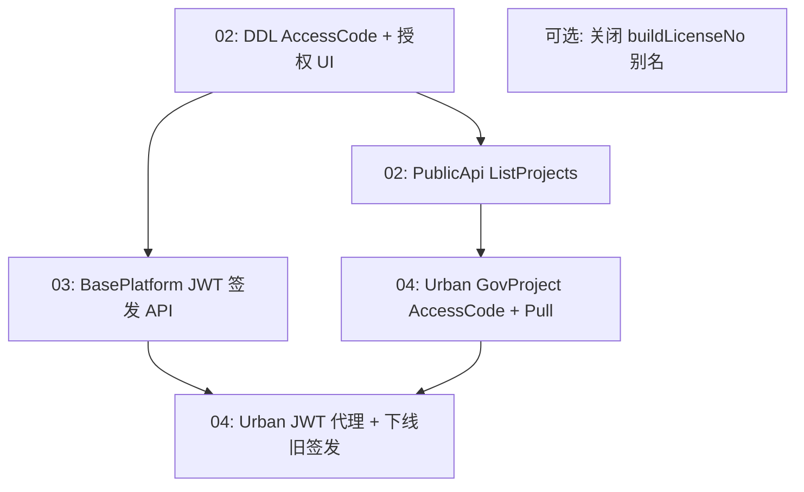

# AccessCode 分离与 JWT 签发迁移 — 联合发版说明

> **文档类型**：协调说明（非单仓库实施正文）  
> **创建日期**：2026-06-24  
> **状态**：拟稿

本目录按 **仓库与主题** 拆分为多份拟稿提案；本文说明依赖关系、推荐发版顺序与文档索引。

---

## 1. 文档地图

| 编号 | 文档 | 仓库 | 主题 |
|------|------|------|------|
| 00 | [00-问题分析.md](./00-问题分析.md) | — | 问题发现 |
| 01 | [01-解决方案.md](./01-解决方案.md) | 全链路 | 目标语义与总方案 |
| 02 | [02-BasePlatform实施拟稿提案.md](./02-BasePlatform实施拟稿提案.md) | BasePlatform + PublicApi | **AccessCode / MachineCode 分列**（库表、授权 UI、ListProjects） |
| 03 | [03-BasePlatform-JWT签发迁移拟稿提案.md](./03-BasePlatform-JWT签发迁移拟稿提案.md) | BasePlatform + PublicApi | **JWT 签发**从 Urban 迁入 |
| 04 | [04-UrbanManagement迁移拟稿提案.md](./04-UrbanManagement迁移拟稿提案.md) | UrbanManagement | **GovProject AccessCode** + **JWT 下线与代理** |
| 05 | [05-联合发版说明.md](./05-联合发版说明.md) | — | 本文档 |

**关联 EPIC**：[2026-06-23-baseplatform-auth-solution/00-EPIC](../2026-06-23-baseplatform-auth-solution/00-EPIC-项目改动总览.md)

---

## 2. 两条主线（勿混淆）

| 主线 | 解决什么 | 主文档 |
|------|----------|--------|
| **A. AccessCode 语义** | 接入码与机器码混用、`BuildLicenseNo` 命名错误 | 02 + 04 §AccessCode |
| **B. JWT 签发归属** | 授权文件由 Urban 签发 → 改由 BasePlatform 签发 | 03 + 04 §JWT |

交叉点：新签发的 JWT Claims 必须使用 **`accessCode`**（不用 `buildLicenseNo`），数据来自 `JC_ProductAuthority.AccessCode` / `GovProject.AccessCode`。

---

## 3. 推荐发版顺序

| 阶段 | 内容 | 可独立上线？ |
|------|------|--------------|
| **P0** | 02 阶段 A：DDL + 双写 `AccessCode` | 是（下游暂不变） |
| **P1** | 02：PublicApi 输出 `accessCode`（保留 `buildLicenseNo` 别名） | 需通知 Urban |
| **P2** | 03：BasePlatform `/api/auth/license-file` 可用 | Urban 仍可暂用旧签发 |
| **P3** | 04：Urban Pull + `GovProject.AccessCode` | 依赖 P1 |
| **P4** | 04：Urban 关旧 JWT 签发，改代理 P2 | 依赖 P2、P3 |
| **P5** | 关闭 PublicApi 兼容别名、清理 Urban 私钥配置 | 依赖 P4 稳定 |

**MaterialClient.Urban** 公钥验证与 `LicenseInfo` 属性重命名 **不在本系列拟稿范围**（见 EPIC）；P2/P4 须保证 Issuer/Audience/算法与现网一致。

---

## 4. 仓库与 PR 划分

| PR | 仓库 | 对应文档 |
|----|------|----------|
| PR-1 | FdSoft.BasePlatform | 02（AccessCode） |
| PR-2 | FdSoft.BasePlatform.PublicApi | 02（ListProjects）+ 03（JWT）可同仓分两 PR |
| PR-3 | UrbanManagement | 04（建议 AccessCode 与 JWT 可分两个 PR，同一发版窗口） |

不必合并为一个跨仓 PR；**发版窗口与回滚预案**在本节与各拟稿 §回滚 中分别写明。

---

## 5. 回滚原则

| 故障点 | 回滚 |
|--------|------|
| PublicApi 字段变更 | 配置 `EmitObsoleteBuildLicenseNo` 或回滚 PublicApi 包 |
| Urban Pull 失败 | 回滚 Urban；BasePlatform 可保留 `AccessCode` 列 |
| JWT 新签发异常 | Urban 临时恢复旧签发（须保留 feature flag 至 P4 验证完成） |
| 数据迁移 | 依赖迁移前表备份；阶段 B 清空 `MachineCode` 须单独变更单 |

---

## 6. 评审会议建议议程

1. 确认 `AccessCode` 语义（01）— 10 min  
2. 评审 02（BasePlatform 数据与 API）— 20 min  
3. 评审 03（JWT 签发迁移）— 20 min  
4. 评审 04（Urban 配合项）— 20 min  
5. 锁定 P0～P4 排期与兼容窗口 — 10 min  

---

**文档版本**：0.1  
**最后更新**：2026-06-24
