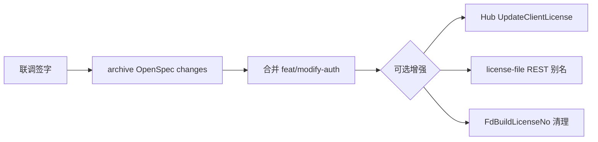

# 遗留项与后续计划

> **阶段**：2026-06-26 开发阶段验收后  
> **关联**：[07-缺口对齐 §1](../2026-06-24-buildlicenseno-machinecode-confusion/07-客户端服务端EPIC缺口对齐拟稿提案.md#1-提案摘要)

---

## 1. 仍开放的缺口（按优先级）

| 优先级 | 主题 | 归属 | 状态 | 建议 |
|--------|------|------|------|------|
| **P0** | 端到端联调签字 | 用户/联调 | 🔲 | 按 [02-联调验收清单](./02-联调验收清单.md) 执行 |
| **P1** | `GET /api/urban/auth/license-file` REST 别名 | UrbanManagement | ❌ | 非阻断；客户端不直连 |
| **P1** | Hub `UpdateClientLicense` 推送 | UrbanManagement | ❌ | 另立 `add-urban-hub-update-client-license` |
| **P2** | `FdBuildLicenseNo` 全链路废弃 | Urban / 政府出站 | ⚠️ | Legacy 清理 change |
| **P2** | `GovProject.LastMachineCodeUpdate` | UrbanManagement | ❌ | 补列或修订 EPIC |
| **P2** | `StaticLicenseChecker` 单元测试 | MaterialClient | ⚠️ | 用例仍为 Skip |

---

## 2. 文档待修订

| 文档 | 修订内容 |
|------|----------|
| [00-EPIC §1.2 样例代码](../2026-06-23-baseplatform-auth-solution/00-EPIC-项目改动总览.md) | `Issuer = "UrbanManagement"` → **`"BasePlatform"`** |
| [07-缺口对齐](../2026-06-24-buildlicenseno-machinecode-confusion/07-客户端服务端EPIC缺口对齐拟稿提案.md) | P0 Urban `activate` → **✅**；§6 步骤 2–3 → 已完成 |
| Monospec `add-urban-auth-activate-proxy` | tasks §6 联调勾选；完成后 **archive** |

---

## 3. 发版与分支建议

| 仓库 | 分支/动作 | 说明 |
|------|-----------|------|
| MaterialClient | `feat/modify-auth` → push → PR | 含 `3ad1daa` 等近期提交 |
| UrbanManagement | 含 `3a17701` 的分支部署 | 与 BasePlatform 同期 |
| BasePlatform.PublicApi | 含 `b7e3e01` 部署 | 注意 `Jwt:PrivateKey` 与公钥分发 |
| 联合发版顺序 | 见 [05-联合发版说明](../2026-06-24-buildlicenseno-machinecode-confusion/05-联合发版说明.md) | P0–P4 已基本走完 |

**配置检查项**（联调常见问题）：

- MaterialClient `appsettings.secret`：Urban API 基址、SignalR 地址
- Urban → BasePlatform Refit 基址与超时
- 客户端 JWT 公钥与 BasePlatform 私钥配对
- Redis 可用（在线授权码）

---

## 4. 下一阶段建议（阶段三）

| 顺序 | 工作 | 类型 |
|------|------|------|
| 1 | 完成 §7 / 02 清单联调并签字 | 验收 |
| 2 | Archive `add-urban-auth-activate-proxy` | Monospec |
| 3 | MaterialClient PR 合并与发版包 | 发版 |
| 4 | （可选）Hub JWT 续期推送 | 增强 |
| 5 | （可选）恢复离线激活 UI（`ShowOfflineActivationUi=true`） | 产品决策 |

---

## 5. 风险提醒（发版前）

| 风险 | 缓解 |
|------|------|
| 环境仍缓存 `iss=UrbanManagement` 旧 JWT | 强制重新在线激活或重下 `.urban` |
| 授权码与接入码术语混淆 | UI 已统一「授权码」；培训运营 |
| 离线 UI 隐藏后现场误操作 | 运维文档保留 B1/B2 路径 |
| 三仓版本不一致 | 按 [00-验收总览](./00-验收总览.md) §4 提交表对齐 |

---

**文档版本**：1.0  
**最后更新**：2026-06-26
