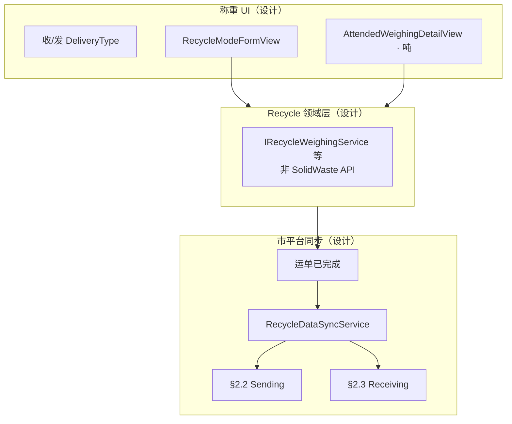

# 目标架构与相对现状的差距

> 综合设计定稿见 [00-调研总览.md](./00-调研总览.md)。

---

## 目标架构

---

## 设计已定 vs 当前代码

| 项 | 设计 | 当前代码 |
|----|------|----------|
| 表单 | `RecycleModeFormView` + `RecycleWeighingDetailViewModel` | 仍共用 SolidWaste 表单/VM |
| 领域 API | **独立 Recycle Service**（不用 `UpdateSolidWasteModeAsync`） | 走 SolidWaste 更新路径 |
| `dataNo` | **`Waybill.OrderNo`** | 部分逻辑用 `R-{id}` 等 |
| 收/发分流 | Sending→§2.2，Receiving→§2.3 | 仅 §2.2，不读 `DeliveryType` |
| 同步门槛 | **运单已完成** | 未严格限制完成态 |
| 照片 API | §2.2/§2.3 **均用进场侧图** | §2.2 偏 `ExitPhoto`/`Lpr` 出场类筛选 |
| `carrierCompanyName` | `ProviderId` → 名称 | 未映射 |
| 重量 | UI 吨；API 按 §2.2 吨 / §2.3 kg | §2.2 已实现 kg÷1000，§2.3 未实现 |
| LPR 无相机 | [04](./04-仅有Lpr设备方案.md) | 未实现 |
| §2.3 客户端 | `materialTransportRecord` | 不存在 |

---

## 实现方向（非 OpenSpec 排期）

按模块推进即可，无需在本综合设计内写变更清单：

1. **UI**：`05` 独立表单 + Recycle VM  
2. **领域**：Recycle 专用 Weighing/Matching Service，**禁止**复用 SolidWaste 更新 API  
3. **附件**：`04` LPR 双附件（无 CameraConfigs）  
4. **同步**：已完成运单 + DeliveryType 分流 + 双 Mapper（重量单位按接口文档）+ 进场图取图 + `carrierCompanyName`

---

## 相关文档

| 文档 | 关系 |
|------|------|
| [00-调研总览.md](./00-调研总览.md) | 设计定稿 |
| [01](./01-字段对照-22发料.md) / [02](./02-字段对照-23收料.md) | 字段映射 |
| [04](./04-仅有Lpr设备方案.md) | LPR |
| [05](./05-Recycle独立表单页面.md) | 表单 |
| [接口 V1.0](../../../MaterialMonospec/docs/SyncDoc/杭州市资源化利用厂数据接入接口V1.0.md) | 字段权威 |
