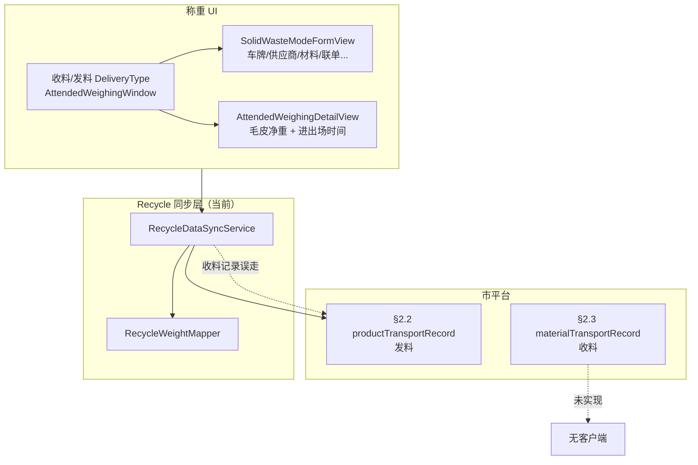

# 缺口汇总与后续建议

---

## 架构现状



---

## 同步层缺口清单

| # | 缺口 | 影响 | 建议 |
|---|------|------|------|
| 1 | 无 §2.3 API 客户端 | 收料无法上报 | 新增 `IRecycleMaterialApi`、`RecycleMaterialTransportRecord` DTO |
| 2 | 未按 `DeliveryType` 分流 | 收料误入 §2.2 | `ProcessRecordAsync` 分支：Sending→2.2，Receiving→2.3 |
| 3 | `dataNo` 映射不一致 | 联单与平台唯一号可能不符 | 优先 `SolidWasteOrderNumber`，回退 `OrderNo` / `R-{id}` |
| 4 | `carrierCompanyName` 未映射 | 可选字段缺失 | 由 `ProviderId` 查 `Provider.ProviderName` |
| 5 | 收料时间/照片语义错误 | §2.2 用 `outTime`+出场照 | §2.3 用 `inTime`+`EntryPhoto` |
| 6 | 重量单位分支 | §2.2 吨、§2.3 kg | Mapper 分两套或参数化 `WeightUnit` |
| 7 | 商务可选字段 | 单价/合同等 | 若运营需要，再扩展 UI 或配置 |
| 8 | UI 完成校验 | SolidWaste 强制镇街/联单 | Recycle 应独立 VM，不校验已删除字段 | 见 [05-Recycle独立表单页面.md](./05-Recycle独立表单页面.md) |

---

## UI 层评估（无需大改即可支撑双接口）

`SolidWasteModeFormView` + 父视图已覆盖双接口**共性必填**：

- 车牌 → `carNo`
- 材料 → `productName` / `materialName`（`Material.Name`）
- 重量 → `netWeight`（及皮/毛）
- 进/出场时间 → 父视图已有，同步层按类型选用

**不必为 §2.3 单独做一套表单**；重点是同步层按 `DeliveryType` 选端点、字段名、单位与照片类型。

---

## OpenSpec 建议

当前变更 `fix-recycle-client-auth-and-resource-place-sync` 的 Non-Goals 已排除 §2.3。完整双接口对接建议**新变更**，例如：

```
add-recycle-material-transport-sync
```

建议 Capabilities：

- `recycle-sync-delivery-type-routing`：按收/发料分流 §2.2 / §2.3
- `recycle-material-transport-api`：§2.3 HMAC 客户端与 DTO
- `recycle-sync-field-mapping`：统一 `dataNo`、`carrierCompanyName`、时间/照片/单位

建议 tasks 要点：

1. 新增 `materialTransportRecord/v1/addBatch` Refit 接口（复用 HMAC Handler）
2. 新增 `RecycleMaterialTransportRecord` DTO 与 `RecycleMaterialWeightMapper`
3. `RecycleDataSyncService` 读取 `WeighingRecord.DeliveryType` 分流
4. 进场照：`EntryPhoto`；出场照：`ExitPhoto`（与现有逻辑拆分）
5. §2.3 重量保持 kg，§2.2 保持 kg÷1000→吨
6. 联调：收料/发料各一条端到端

---

## 与既有文档关系

| 文档 | 关系 |
|------|------|
| [2026-07-09-recycle-client-proposal-draft](../../../MaterialMonospec/docs/SyncDoc/2026-07-09-recycle-client-proposal-draft.md) | 范围仅 §2.2；本调研补充 §2.3 与 UI 差距 |
| [杭州市资源化利用厂数据接入接口 V1.0](../../../MaterialMonospec/docs/SyncDoc/杭州市资源化利用厂数据接入接口V1.0.md) | 字段权威来源 |
| [MaterialMonospec/openspec/.../design.md](../../../MaterialMonospec/openspec/changes/fix-recycle-client-auth-and-resource-place-sync/design.md) | D6：§2.2 不变；本调研建议后续 change 扩展 |
| [2026-07-07 Recycle 新客户端调研](../2026-07-07-materialclient-recycle-new-client/00-调研总览.md) | 架构与 §2.2 管线前置调研 |
| [04-仅有Lpr设备方案.md](./04-仅有Lpr设备方案.md) | 无 CameraConfigs 时 LPR → UnmatchedEntryPhoto；MaterialClient 各模式 |
| [05-Recycle独立表单页面.md](./05-Recycle独立表单页面.md) | Recycle 独立表单，删除联单/镇街/类型三字段 |

---

## 调研方法说明

- 对照接口文档 §2.2、§2.3 Request 参数表
- 阅读 `SolidWasteModeFormView.axaml`、`AttendedWeighingDetailView.axaml`、`SolidWasteWeighingDetailViewModel`
- 阅读 `RecycleDataSyncService`、`RecycleWeightMapper`、`RecycleTransportRecord`
- 确认 Recycle 复用 `SolidWasteWeighingDetailViewModel`（`AttendedWeighingViewModel` Recycle 分支）

**调研日期**：2026-07-09
